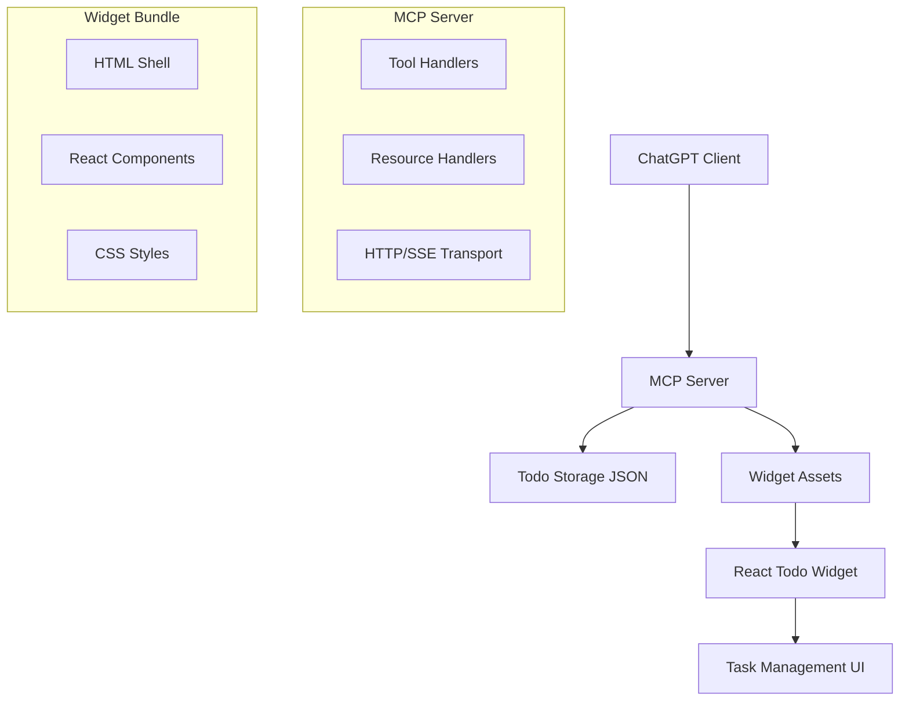

# Todo ChatGPT App Design Document

## Overview

The Todo ChatGPT App will be a complete task management application that integrates with ChatGPT through the Model Context Protocol (MCP). It follows the established patterns from the pizzaz examples, providing both conversational task management and a rich UI widget for visual interaction.

The application consists of three main components:
1. **MCP Server** - Handles tool calls and serves widget assets
2. **UI Widget** - React-based interface for task management
3. **Data Layer** - JSON file-based persistence for todos

## Architecture

### System Architecture



### Data Flow

1. **Tool Invocation**: ChatGPT calls todo tools with natural language intent
2. **Server Processing**: MCP server validates input, performs CRUD operations
3. **Data Persistence**: Changes are saved to JSON file
4. **Widget Response**: Server returns structured data + widget metadata
5. **UI Rendering**: ChatGPT renders the widget with updated todo data

## Components and Interfaces

### MCP Server Components

#### Tool Definitions
```typescript
interface TodoTool {
  name: string;
  description: string;
  inputSchema: JSONSchema;
  handler: (params: any) => Promise<ToolResult>;
}
```

**Available Tools:**
- `list-todos` - Get all todos with optional filtering
- `create-todo` - Add a new todo item
- `update-todo` - Modify existing todo properties
- `complete-todo` - Mark todo as completed/incomplete
- `delete-todo` - Remove todo from list

#### Input Schemas
```typescript
interface CreateTodoInput {
  title: string;
  description?: string;
  dueDate?: string; // ISO date string
  priority?: 'low' | 'medium' | 'high';
}

interface UpdateTodoInput {
  id: string;
  title?: string;
  description?: string;
  dueDate?: string;
  priority?: 'low' | 'medium' | 'high';
  completed?: boolean;
}

interface TodoFilter {
  completed?: boolean;
  priority?: 'low' | 'medium' | 'high';
  overdue?: boolean;
}
```

#### Resource Handlers
- **Widget Template**: Serves the bundled HTML widget
- **Static Assets**: CSS and JS files for the widget
- **Todo Data**: Structured todo data for widget hydration

### UI Widget Components

#### Component Hierarchy
```
TodoApp
├── TodoHeader
│   ├── AddTodoForm
│   └── FilterControls
├── TodoList
│   ├── TodoItem
│   │   ├── TodoCheckbox
│   │   ├── TodoContent
│   │   └── TodoActions
│   └── EmptyState
└── TodoFooter
    └── TodoStats
```

#### Key Components

**TodoApp** - Root component managing global state
- Handles widget props from ChatGPT
- Manages todo list state
- Coordinates with MCP server

**TodoItem** - Individual todo representation
- Inline editing capabilities
- Drag and drop reordering
- Due date visualization
- Priority indicators

**AddTodoForm** - New todo creation
- Quick add input
- Expanded form for details
- Keyboard shortcuts

### Widget Integration

#### OpenAI Widget Metadata
```typescript
interface WidgetMeta {
  "openai/outputTemplate": string;
  "openai/toolInvocation/invoking": string;
  "openai/toolInvocation/invoked": string;
  "openai/widgetAccessible": boolean;
  "openai/resultCanProduceWidget": boolean;
}
```

#### State Synchronization
- Widget receives initial data via `structuredContent`
- Updates are communicated through `window.oai.widget.setState()`
- Display mode changes handled via `useOpenAiGlobal("displayMode")`

## Data Models

### Todo Data Structure
```typescript
interface Todo {
  id: string;
  title: string;
  description: string;
  completed: boolean;
  createdAt: string; // ISO timestamp
  updatedAt: string; // ISO timestamp
  dueDate?: string; // ISO date string
  priority: 'low' | 'medium' | 'high';
  tags: string[];
}

interface TodoList {
  todos: Todo[];
  metadata: {
    version: string;
    lastModified: string;
    totalCount: number;
    completedCount: number;
  };
}
```

### Storage Schema
```json
{
  "version": "1.0.0",
  "lastModified": "2024-01-01T00:00:00Z",
  "todos": [
    {
      "id": "uuid-string",
      "title": "Sample Todo",
      "description": "Description text",
      "completed": false,
      "createdAt": "2024-01-01T00:00:00Z",
      "updatedAt": "2024-01-01T00:00:00Z",
      "dueDate": "2024-01-02",
      "priority": "medium",
      "tags": ["work", "urgent"]
    }
  ]
}
```

## Error Handling

### Server Error Handling
- **Validation Errors**: Return structured error responses with field-specific messages
- **File System Errors**: Graceful fallback to in-memory storage with user notification
- **Tool Call Errors**: Proper HTTP status codes and error descriptions
- **Widget Loading Errors**: Fallback to text-only responses

### Client Error Handling
- **Network Failures**: Retry logic with exponential backoff
- **Widget Errors**: Error boundaries to prevent crashes
- **State Corruption**: Reset to last known good state
- **Validation Errors**: Inline form validation with helpful messages

### Error Response Format
```typescript
interface ErrorResponse {
  error: true;
  message: string;
  code: string;
  details?: Record<string, any>;
}
```

## Testing Strategy

### Unit Testing
- **Tool Handlers**: Test CRUD operations with mock data
- **Validation**: Test input schema validation with edge cases
- **Storage**: Test file operations with temporary files
- **Components**: Test React components with React Testing Library

### Integration Testing
- **MCP Protocol**: Test full request/response cycles
- **Widget Integration**: Test widget metadata and state sync
- **File Persistence**: Test data persistence across server restarts
- **Error Scenarios**: Test error handling and recovery

### End-to-End Testing
- **ChatGPT Integration**: Test with actual ChatGPT client
- **Widget Rendering**: Test widget display in different modes
- **User Workflows**: Test complete task management scenarios
- **Cross-browser**: Test widget compatibility across browsers

### Test Data
- **Sample Todos**: Predefined test data for consistent testing
- **Edge Cases**: Empty lists, malformed data, large datasets
- **Performance**: Test with large numbers of todos
- **Concurrency**: Test multiple simultaneous operations

## Performance Considerations

### Server Performance
- **Caching**: Cache widget assets in memory
- **File I/O**: Debounce file writes to reduce disk operations
- **Memory Usage**: Limit in-memory todo storage size
- **Response Time**: Target <100ms for tool calls

### Widget Performance
- **Bundle Size**: Keep widget bundle under 500KB
- **Rendering**: Use React.memo for expensive components
- **Virtual Scrolling**: For large todo lists (>100 items)
- **Lazy Loading**: Load widget assets on demand

### Scalability
- **Data Storage**: Design for future database migration
- **Multi-user**: Prepare for user-specific todo lists
- **Real-time**: Consider WebSocket for live updates
- **Deployment**: Support horizontal scaling patterns

## Design System & Colors

### Official ChatGPT App Colors

#### 🌞 Light Mode Colors

**Background / Light**
- Primary: `#FFFFFF`
- Secondary: `#E6E6E6`
- Tertiary: `#F3F3F3`

**Text / Light**
- Text / Primary: `#000000`
- Text / Secondary: `#505050`
- Text / Tertiary: `#BFBFBF`
- Text / Inverted: `#FFFFFF`

**Icon / Light**
- Icon / Primary: `#000000`
- Icon / Secondary: `#505050`
- Icon / Tertiary: `#BFBFBF`
- Icon / Inverted: `#FFFFFF`

#### 🌙 Dark Mode Colors

**Background / Dark**
- Primary: `#121212`
- Secondary: `#383838`
- Tertiary: `#414141`

**Text / Dark**
- Text / Primary: `#FFFFFF`
- Text / Secondary: `#C0C0C0`
- Text / Tertiary: `#AFAFAF`
- Text / Inverted: `#121212`

**Icon / Dark**
- Icon / Primary: `#FFFFFF`
- Icon / Secondary: `#C0C0C0`
- Icon / Tertiary: `#AFAFAF`
- Icon / Inverted: `#121212`

#### Accent Colors (Both Modes)
- Accent / Blue: `#2655FF`
- Accent / Red: `#E6222A` (Light) / `#FF5858` (Dark)
- Accent / Orange: `#E2561F` (Light) / `#FF9C6C` (Dark)
- Accent / Green: `#08B635` (Light) / `#1AD977` (Dark)

### CSS Custom Properties Implementation

```css
:root {
  /* Light mode (default) */
  --bg-primary: #FFFFFF;
  --bg-secondary: #E6E6E6;
  --bg-tertiary: #F3F3F3;
  
  --text-primary: #000000;
  --text-secondary: #505050;
  --text-tertiary: #BFBFBF;
  --text-inverted: #FFFFFF;
  
  --icon-primary: #000000;
  --icon-secondary: #505050;
  --icon-tertiary: #BFBFBF;
  --icon-inverted: #FFFFFF;
  
  --accent-blue: #2655FF;
  --accent-red: #E6222A;
  --accent-orange: #E2561F;
  --accent-green: #08B635;
}

@media (prefers-color-scheme: dark) {
  :root {
    --bg-primary: #121212;
    --bg-secondary: #383838;
    --bg-tertiary: #414141;
    
    --text-primary: #FFFFFF;
    --text-secondary: #C0C0C0;
    --text-tertiary: #AFAFAF;
    --text-inverted: #121212;
    
    --icon-primary: #FFFFFF;
    --icon-secondary: #C0C0C0;
    --icon-tertiary: #AFAFAF;
    --icon-inverted: #121212;
    
    --accent-red: #FF5858;
    --accent-orange: #FF9C6C;
    --accent-green: #1AD977;
  }
}
```

### Component Color Usage Guidelines

- **Primary Actions**: Use `--accent-blue` for main CTAs and active states
- **Success States**: Use `--accent-green` for completed todos and success messages
- **Warning/Due Soon**: Use `--accent-orange` for due date warnings
- **Error/Delete**: Use `--accent-red` for destructive actions and errors
- **Backgrounds**: Layer `--bg-primary` → `--bg-secondary` → `--bg-tertiary` for depth
- **Text Hierarchy**: `--text-primary` for main content, `--text-secondary` for labels, `--text-tertiary` for placeholders

## Security Considerations

### Input Validation
- **Schema Validation**: Strict input validation using Zod
- **Sanitization**: HTML/XSS protection for user content
- **Rate Limiting**: Prevent abuse of tool endpoints
- **File Access**: Restrict file operations to designated directories

### Data Protection
- **File Permissions**: Secure todo data file access
- **CORS Policy**: Restrictive CORS for production
- **Error Messages**: Avoid exposing sensitive information
- **Logging**: Secure logging without personal data

### Widget Security
- **CSP Headers**: Content Security Policy for widget
- **Iframe Sandboxing**: If using iframe embedding
- **State Validation**: Validate widget state updates
- **XSS Prevention**: Sanitize all user-generated content